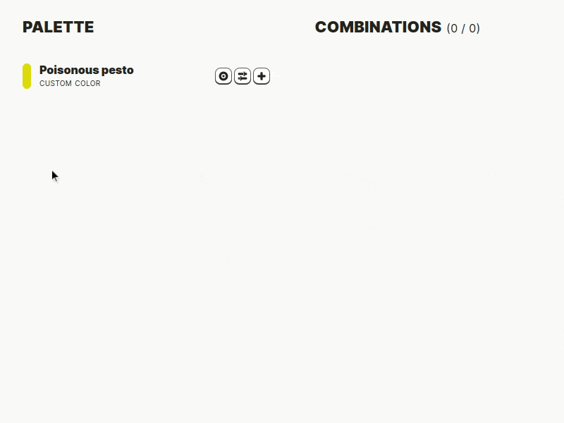

# Schemist

Build cohesive and accessible color schemes :
[schemist.fglt.fr](http://schemist.fglt.fr)

Note that Schemist is still in its early days, so things might be
subject to change. Feel free to report bugs or suggest
improvements!

## Concept

Schemist builds on color theory to let you create cohesive color
schemes with ease. Colors are defined as a tree, where each one
depends on its parent. This allows for building a whole palette
based on one color, and get a whole new palette by just changing
this base color.

Schemist provides modifiers, for example to lighten or darken a
color, shift its hue, find common harmonies (complementary,
triad, tetrad, ...), find contrasting colors, and more.

To ease the process, a set of presets is included, allowing you
to generate whole palettes from a base color in one click.

While building your palette, you'll be able to review the
contrast of each color combination to ensure that they are
accessible to everyone.

The whole thing is reactive, so play around!

## How it works

Dear color theory experts, please don't get mad.

Schemist uses its own "color space", or more prcisely mixes and
matches two of them. It rotates hues with Oklch, which has more
uniform hues than, say, HSL. However, instead of using Oklch's
chroma and lightness, it uses saturation and lightness from
Okhsl, as it is a more human-friendly way of interacting with
color.

Yes, it is probably wrong on many levels, but to me it yielded
the best results overall, in terms of ergonomics and outputs.

## Kudos

Schemist is build upon these fabulous projects and resources:

-  [SvelteKit](https://kit.svelte.dev/)
-  [Culori](https://github.com/Evercoder/culori) for the core
   color mechanics
-  [color-name-list](https://github.com/meodai/color-names) to
   name colors
-  [nearest-color](https://github.com/dtao/nearest-color) to find
   matching color names
-  [APCA](https://github.com/Myndex/apca-w3) to calculate
   contrast ratios
-  [Inter](https://rsms.me/inter/) for the main font
-  [Source code pro](https://fonts.adobe.com/fonts/source-code-pro)
   for monospace texts
-  [Font Squirrel generator](https://www.fontsquirrel.com/tools/webfont-generator)
   to subset Source code pro

## Resources

-  [Making a useful LCh color palette](https://ninedegreesbelow.com/photography/gimp-srgb-lch-color-palettes.html#saturation)
-  [Using LCh to pick complementary colors and for making hue-based color harmonies](https://ninedegreesbelow.com/photography/lch-complements-and-color-harmonies.html)
-  [How to Convert Temperature (K) to RGB: Algorithm and Sample Code](https://tannerhelland.com/2012/09/18/convert-temperature-rgb-algorithm-code.html)
